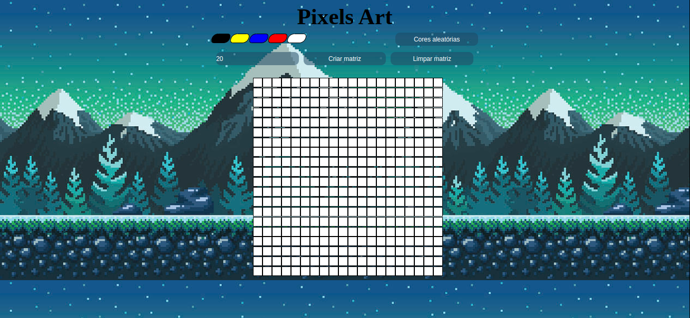

# Pixels Art Project

## Descrição do Projeto

O Pixels Art é uma aplicação web que permite criar arte pixelizada de forma simples e interativa. Utilizando as tecnologias HTML, CSS, Javascript, Local Storage e DOM, o projeto oferece uma experiência de desenho com uma matriz personalizável e funcionalidades intuitivas.

### Funcionalidades

1. Matriz Personalizável
É possível criar uma matriz no tamanho entre 5 x 5 e 50 x 50, proporcionando flexibilidade na criação da arte pixelizada.
2. Limpar Matriz
Um botão dedicado à limpeza da matriz facilita a remoção de desenhos antigos, proporcionando um novo espaço em branco para a sua próxima criação.
3. Cores Aleatórias
Um botão especial gera três cores aleatórias, adicionando um toque de espontaneidade e diversidade às suas criações.
4. Local Storage
As alterações na matriz são automaticamente salvas no Local Storage. Isso significa que, ao reiniciar a aplicação, as últimas alterações realizadas serão recuperadas, garantindo a continuidade do seu trabalho.

### Como Usar

Acessar: [Ver Projeto](https://jefersonviana.github.io/project-pixels-art/)

### Contribuições

Contribuições são bem-vindas! Sinta-se à vontade para abrir issues, propor melhorias ou enviar pull requests para tornar o Pixels Art ainda melhor.

### Licença

Este projeto é licenciado sob a MIT License.